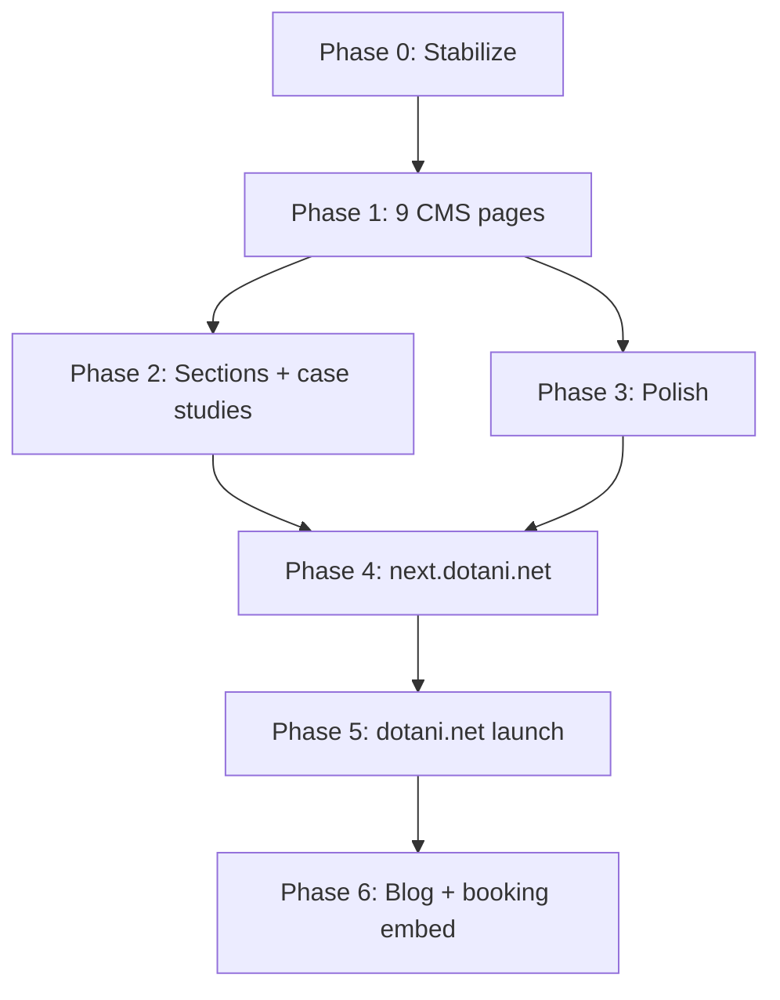

# Completion Plan — Dotani.net

**Locked scope (client confirmed, Jun 2026)**

| Decision | Choice |
|----------|--------|
| Page scope | **Full 9-page wireframe** |
| Blog | **Phase 2** (post-launch) |
| Case studies | **Phase 1** — before launch |
| Booking | **Cal.com link/section now**; full embed page later |
| Datasets | `staging` = dev · `production` = live |
| Assets | Final files → `/assets` folder; placeholders OK during dev |
| Deploy URL | **`next.dotani.net`** now · **`dotani.net`** at launch |

---

## Target: 9 pages (wireframe §13)

| # | Page | Route | Status |
|---|------|-------|--------|
| 1 | Home | `/` | ✅ CMS sections (gaps remain) |
| 2 | Services | `/services` | ⚠️ Hardcoded hero |
| 3 | Single Service | `/services/[slug]` | ⚠️ Thin detail, bad rich text |
| 4 | Portfolio | `/portfolio` | ⚠️ Hardcoded hero |
| 5 | Single Portfolio | `/portfolio/[slug]` | ⚠️ Thin detail |
| 6 | Case Study | `/case-studies/[slug]` | ❌ Not built |
| 7 | Profile / About | `/profile` | ❌ Not built |
| 8 | Contact | `/contact` | ❌ Not built (section on home only) |
| 9 | Booking | `/booking` | ❌ Not built (Cal.com section on home only) |

---

## Phase 0 — Stabilize (Day 1) ✅ DONE

| # | Task | Status |
|---|------|--------|
| 0.1 | Fix Prompts doc references (`00`, `03`) | ✅ |
| 0.2 | Fix seed pipeline (`scripts/seed-source.js` + `seed.ndjson` fallback) | ✅ |
| 0.3 | Align datasets: Studio + web `.env` → `staging` locally | ✅ |
| 0.4 | Add `pages/404.astro` | ✅ |
| 0.5 | Create `/assets` folder + README for final file drop | ✅ |
| 0.6 | Run `npm run seed:import` → `npm run seed:verify` | ✅ |

---

## Phase 1 — Unified page architecture (Days 1–2) ✅ DONE

| # | Task | Status |
|---|------|--------|
| 1.1 | `PageSections.astro` + `CmsPage.astro` — shared renderer | ✅ |
| 1.2 | `[slug].astro` — `/profile`, `/contact`, `/booking` | ✅ |
| 1.3 | Studio structure — 6 page singletons in Site menu | ✅ |
| 1.4 | Services + Portfolio listing → full CMS `CmsPage` | ✅ |
| 1.5 | `PortableText.astro` — hero, why-me, service/portfolio detail | ✅ |
| 1.6 | Seed 6 CMS pages + full nav (6 items) | ✅ |

**Booking note:** `/booking` page = hero + copy + Cal.com **link** (not embed). Embed = Phase 2.

**Note:** Single service/portfolio detail routes remain bespoke templates (Phase 2 enrichment).

---

## Phase 2 — Wireframe + case studies (Days 3–5)

| # | Task | Priority |
|---|------|----------|
| 2.1 | `introValueSection` (What I Do / Who This Is For) | P0 |
| 2.2 | `profileHighlightSection` | P0 |
| 2.3 | `faqSection` (accordion) | P1 |
| 2.4 | Case study routes `/case-studies/[slug]` + portfolio links | ✅ Done |
| 2.5 | Enrich service/portfolio detail (gallery, metrics, related) | P0 |
| 2.6 | Portfolio filter chips | P1 |
| 2.7 | Sticky Book CTA + WhatsApp float (CMS toggles) | P1 |
| 2.8 | Breadcrumbs component | P1 |

**Deferred:** blog routes, booking Cal.com embed, `tool` content type, newsletter.

---

## Phase 3 — Polish (Days 5–6)

| # | Task |
|---|------|
| 3.1 | Sanity image URL builder + responsive images |
| 3.2 | Swap placeholders → `/assets` files → Sanity upload |
| 3.3 | SEO meta, OG, JSON-LD from `seoAeo` fields |
| 3.4 | Prerender content routes or remove dead `getStaticPaths` |
| 3.5 | A11y pass + reduced-motion-safe animation |

---

## Phase 4 — Deploy to next.dotani.net (Day 6–7)

| # | Task |
|---|------|
| 4.1 | Cloudflare Pages → `next.dotani.net` |
| 4.2 | CF env vars: `PUBLIC_SANITY_DATASET=staging`, Turnstile, Resend, Cal.com |
| 4.3 | Deploy Sanity Studio (`sanity deploy`) |
| 4.4 | Smoke test all 9 routes + case studies + forms |
| 4.5 | Client content review in Studio (staging) |

---

## Phase 5 — Launch on dotani.net (when approved)

| # | Task |
|---|------|
| 5.1 | `npm run seed:import:production` |
| 5.2 | CF production env: `PUBLIC_SANITY_DATASET=production` |
| 5.3 | Point `dotani.net` DNS to Cloudflare Pages |
| 5.4 | Final QA + redirect `next` → `dotani.net` if needed |

---

## Phase 6 — Post-launch

| Item | When |
|------|------|
| Blog routes + RSS | After launch |
| Booking page Cal.com embed | After launch |
| Sanity TypeGen + Visual Editing | Ongoing |
| Analytics (Plausible/Fathom) | At launch or shortly after |

---

## Timeline

| Milestone | Days | Deliverable |
|-----------|------|-------------|
| Phase 0–1 | 2 | All routes exist, CMS-driven, seed works |
| Phase 2 | 3 | Full wireframe sections + case studies |
| Phase 3–4 | 2 | Polished site on `next.dotani.net` |
| Phase 5 | 1 | `dotani.net` live |

**Total: ~7–8 focused days** to full wireframe on staging URL.

---

## Execution order

---

## Immediate next actions

1. ~~Scope questions~~ — **answered**
2. Phase 0: seed fix, 404, doc updates, `/assets` folder
3. Phase 1: `PageSections` + `[slug]` + Studio pages list
4. Seed pages: profile, contact, booking, services-overview, portfolio-overview
5. Case study frontend (schema already exists)

See `06-LAUNCH_CHECKLIST.md` for per-page done criteria.